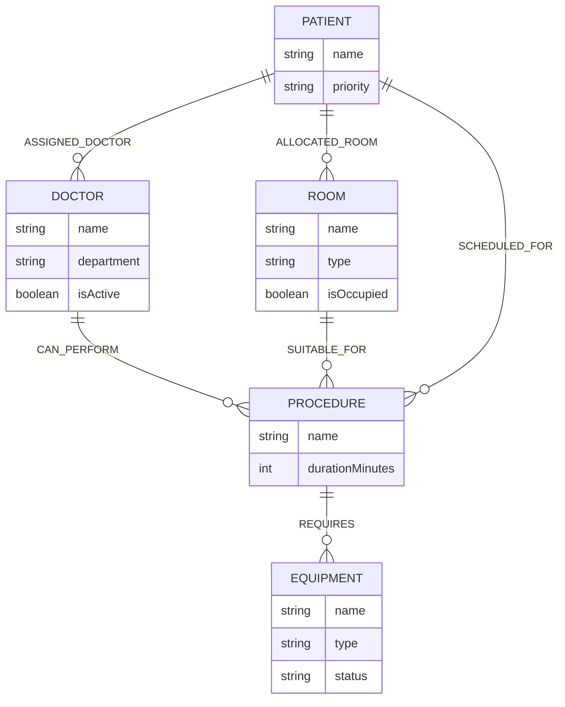
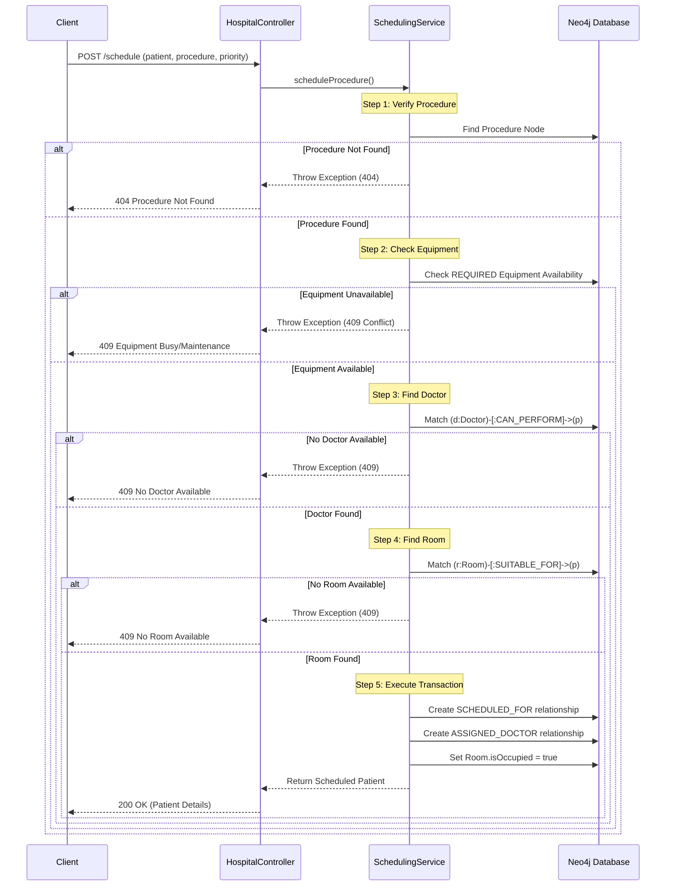
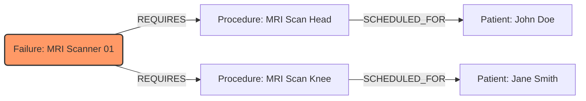

# Architecture Diagrams

## 1. System Architecture Overview
```mermaid
graph TD
    Client[REST API Clients<br/>(Postman, Frontend, Mobile)] -->|HTTP/JSON| SpringBoot
    subgraph SpringBoot [Spring Boot 4.0.2 Application]
        direction TB
        subgraph Presentation [Presentation Layer]
            HC[HospitalController<br/>/api/hospital]
            VC[VerificationController<br/>/api/verify]
            AC[AuthController<br/>/auth]
        end
        subgraph Business [Business Logic Layer]
            SS[Scheduling Service]
            IAS[Impact Analysis Service]
        end
        subgraph DataAccess [Data Access Layer]
            DR[Doctor Repository]
            RR[Room Repository]
            ER[Equipment Repository]
        end
        
        Presentation --> Business
        Business --> DataAccess
    end
    
    DataAccess -->|Spring Data Neo4j| Neo4j[(Neo4j Graph Database<br/>Nodes & Relationships)]
```

## 2. Domain Model (Entity Relationship)


## 3. Scheduling Algorithm Flow


## 4. Impact Analysis (Failure Propagation)

